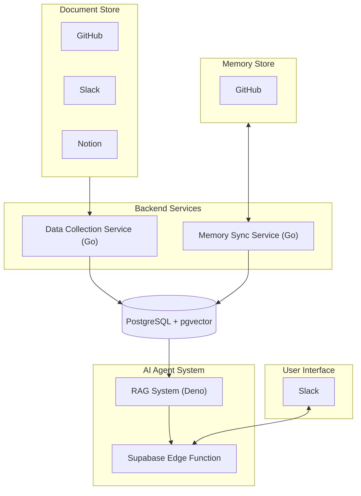

# ✨ Personal Agent

📚 **Purpose**

> An AI Agent that collects various contexts, and uses this information to enable chat and actions.
> This repository aims to collect information from GitHub repositories, Slack, Notion, and other sources.
> The agent has memory functionality to store and synchronize its own memories with external services (GitHub/Notion).

**Current Status**: Work in Progress - Only GitHub data collection is currently implemented.

---

## 1. System Architecture

The Personal Agent system consists of several key components working together:



### Key Components:

1. **Data Collection Service**: Currently implemented in Go, collects data from various sources like GitHub, Slack, and Notion.

2. **Memory Sync Service**: Synchronizes agent's memories with external services.

3. **Data Storage**: PostgreSQL with pgvector extension for vector embeddings storage and retrieval.

4. **AI Agent**: A RAG (Retrieval Augmented Generation) system built with Deno, hosted on Supabase Edge Functions.

5. **User Interface**: Slack integration allowing users to chat with the agent directly from Slack.

The system flow starts with collecting data from various sources, storing it in the database, and then using that data to power the AI agent's responses through the RAG system. Users interact with the agent primarily through Slack.

---

## 2. Tech Stack

| Component                | Runtime / Technology                            | Libraries / Notes                               |
| ------------------------ | ----------------------------------------------- | ----------------------------------------------- |
| **Data Collection**      | **Go**                                          | Clean architecture with domain-driven design    |
| **Memory Sync**          | **Go**                                          | Document synchronization and storage            |
| **Storage**              | **PostgreSQL + pgvector**                       | Vector embeddings for semantic search           |
| **AI Agent**             | **Deno**                                        | RAG (Retrieval Augmented Generation)            |
| **Hosting**              | **Supabase Edge Functions**                     | Serverless deployment for AI agent              |
| **User Interface**       | **Slack App**                                   | Chat interface for interacting with agent       |
| **Local Development**    | **Docker Compose**                              | Containerized local development environment     |

---

## 3. Repository Layout

```
personal-agent/
├─ go/                       # Go sources
│  ├─ internal/              # Private application code
│  │   ├─ domain/            # Enterprise business rules
│  │   │   ├─ model/         # Core domain entities and value objects
│  │   │   └─ port/          # Interfaces defining domain boundaries
│  │   ├─ usecase/           # Application business rules
│  │   │   ├─ document/      # Document-related use cases
│  │   │   └─ store/         # Storage-related use cases
│  │   └─ infrastructure/    # Frameworks, drivers, and external implementations
│  │       ├─ database/      # Database connections and utilities
│  │       ├─ embedding/     # Embedding service implementations
│  │       ├─ repository/    # Repository implementations
│  │       ├─ storage/       # Storage implementations (GitHub, local)
│  │       └─ util/          # Utility functions
│  ├─ cmd/                   # Application entry points
│  │   └─ cli/               # Command-line interface
│  ├─ config/                # Configuration files
│  ├─ migrations/            # Database migrations
│  └─ bin/                   # Compiled binaries
│
├─ docker-compose.yml        # Docker Compose configuration
└─ README.md (← **YOU ARE HERE**)
```

---

## 4. Quick Start (Local)

```bash
# 1. Clone the repository
git clone https://github.com/bonyuta0204/personal-agent.git
cd personal-agent

# 2. Setup environment variables
cp go/.env.sample go/.env

# 3. Build the CLI tool
cd go
make build

# 4. Run the CLI tool
./bin/personal-agent --help
```

> **⚠️ Environment variables** are documented in `go/.env.sample`.

---

## 6. Storage Backends

The application supports multiple storage backends:

1. **GitHub Storage** - Store documents in a GitHub repository
2. **Local Storage** - Store documents locally on your machine

Storage implementations are located in `go/internal/infrastructure/storage/`.

---

## 7. Makefile Highlights

```makefile
build:             ## Build the CLI tool
test:              ## Run tests
clean:             ## Clean build artifacts
```

Check the `go/Makefile` for all available commands.

---

## 8. CLI Commands

The application provides a CLI tool with the following commands:

### Store Management

```bash
# List all document stores
./bin/personal-agent store list

# Create a new document store (GitHub repository)
./bin/personal-agent store create owner/repo
```

### Document Management

```bash
# Sync documents from a specific store
./bin/personal-agent document sync <store-id>

# Sync with dry-run option (no changes)
./bin/personal-agent document sync <store-id> --dry-run
```

Document operations are implemented in the `go/internal/usecase/document` package, and store operations in the `go/internal/usecase/store` package.

---

## 9. Project Architecture

The project follows clean architecture principles with a focus on domain-driven design:

1. **Domain Layer** - Contains core business entities and interfaces
2. **Use Case Layer** - Implements application-specific business rules
3. **Infrastructure Layer** - Provides concrete implementations of interfaces

This separation of concerns allows for easy testing and maintenance.

---

## 10. Contributing

1. Open a PR targeting `main`.
2. Ensure `make test lint` passes.
3. A reviewer merges after minimum one approval.

---

## 11. Roadmap

* [ ] Add support for additional data sources (Slack, Notion)
* [ ] Implement memory functionality for the agent
* [ ] Enable synchronization with external services
* [ ] Add search functionality
* [ ] Improve CLI user experience
