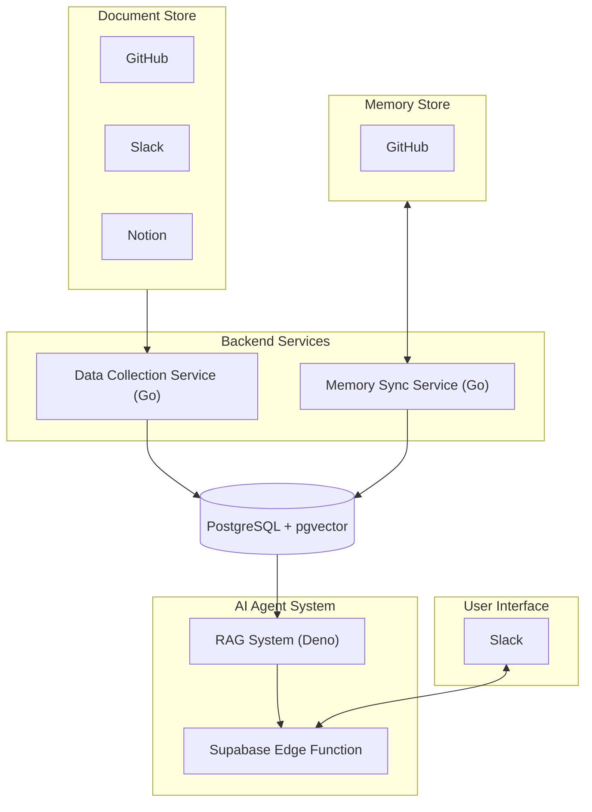

# ✨ Personal Agent

📚 **Purpose**

> An AI Agent that collects various contexts, and uses this information to enable chat and actions.
> This repository aims to collect information from GitHub repositories, Slack, Notion, and other sources.
> The agent has memory functionality to store and synchronize its own memories with external services (GitHub/Notion).

**Current Status**: Work in Progress - Only GitHub data collection is currently implemented.

---

## 1. System Architecture

The Personal Agent system consists of several key components working together:



### Key Components:

1. **Data Collection Service**: Currently implemented in Go, collects data from various sources like GitHub, Slack, and Notion.

2. **Memory Sync Service**: Synchronizes agent's memories with external services.

3. **Data Storage**: PostgreSQL with pgvector extension for vector embeddings storage and retrieval.

4. **AI Agent**: A RAG (Retrieval Augmented Generation) system built with Deno, hosted on Supabase Edge Functions.

5. **User Interface**: Slack integration allowing users to chat with the agent directly from Slack.

The system flow starts with collecting data from various sources, storing it in the database, and then using that data to power the AI agent's responses through the RAG system. Users interact with the agent primarily through Slack.

---

## 2. Tech Stack

| Component                | Runtime / Technology                            | Libraries / Notes                               |
| ------------------------ | ----------------------------------------------- | ----------------------------------------------- |
| **Data Collection**      | **Go**                                          | Clean architecture with domain-driven design    |
| **Memory Sync**          | **Go**                                          | Document synchronization and storage            |
| **Storage**              | **PostgreSQL + pgvector**                       | Vector embeddings for semantic search           |
| **AI Agent**             | **Deno**                                        | LangChain, OpenAI API, RAG                      |
| **Hosting**              | **Supabase Edge Functions**                     | Serverless deployment for AI agent              |
| **User Interface**       | **Slack App / CLI**                             | Chat interfaces for interacting with agent      |
| **Local Development**    | **Docker Compose**                              | Containerized local development environment     |

---

## 3. Repository Layout

```
personal-agent/
├─ go/                       # Go sources (Data collection & sync)
│  ├─ internal/              # Private application code
│  │   ├─ domain/            # Enterprise business rules
│  │   │   ├─ model/         # Core domain entities and value objects
│  │   │   └─ port/          # Interfaces defining domain boundaries
│  │   ├─ usecase/           # Application business rules
│  │   │   ├─ document/      # Document-related use cases
│  │   │   └─ store/         # Storage-related use cases
│  │   └─ infrastructure/    # Frameworks, drivers, and external implementations
│  │       ├─ database/      # Database connections and utilities
│  │       ├─ embedding/     # Embedding service implementations
│  │       ├─ repository/    # Repository implementations
│  │       ├─ storage/       # Storage implementations (GitHub, local)
│  │       └─ util/          # Utility functions
│  ├─ cmd/                   # Application entry points
│  │   └─ cli/               # Command-line interface
│  ├─ config/                # Configuration files
│  ├─ migrations/            # Database migrations
│  └─ bin/                   # Compiled binaries
│
├─ typescript/               # TypeScript sources (AI Agent)
│  ├─ src/
│  │   ├─ agent/             # LangChain agent implementation
│  │   ├─ cli/               # Interactive CLI chat interface
│  │   ├─ config/            # Environment configuration
│  │   ├─ tools/             # Agent tools (document search)
│  │   └─ types/             # TypeScript type definitions
│  ├─ deno.json              # Deno configuration
│  └─ README.md              # TypeScript module documentation
│
├─ docker-compose.yml        # Docker Compose configuration
└─ README.md (← **YOU ARE HERE**)
```

---

## 4. Quick Start (Local)

### 4.1 Setup Data Collection (Go)

```bash
# 1. Clone the repository
git clone https://github.com/bonyuta0204/personal-agent.git
cd personal-agent

# 2. Start PostgreSQL with pgvector
docker-compose up -d

# 3. Setup environment variables
cp go/.env.sample go/.env
# Edit go/.env with your credentials

# 4. Build the CLI tool
cd go
make build

# 5. Create a document store (e.g., GitHub repository)
./bin/personal-agent store create owner/repo

# 6. Sync documents from the store
./bin/personal-agent document sync <store-id>
```

### 4.2 Run AI Agent (TypeScript)

```bash
# 1. Navigate to TypeScript directory
cd typescript

# 2. Setup environment variables
cp .env.sample .env
# Edit .env with your OpenAI API key and database credentials

# 3. Start the AI chat interface
deno task start
```

You'll see:
```
🤖 Personal Agent
Type your questions naturally. Type 'exit' to quit.
```

Now you can chat with the agent using natural language!

### 4.3 Environment Configuration

**TypeScript AI Agent** requires these environment variables:

```bash
# Database Configuration
DB_HOST=localhost
DB_PORT=5432
DB_NAME=personal_agent
DB_USER=postgres
DB_PASSWORD=yourpassword
DB_SSL=false

# OpenAI Configuration
OPENAI_API_KEY=sk-...  # Required
OPENAI_MODEL=gpt-4o-mini  # Optional (default: gpt-4o-mini)
OPENAI_EMBEDDING_MODEL=text-embedding-3-small  # Optional
```

> **⚠️ Full environment variables** are documented in `go/.env.sample` and `typescript/.env.sample`.

---

## 5. Using the AI Agent

### 5.1 Overview

The AI Agent uses RAG (Retrieval Augmented Generation) to answer questions based on your synchronized documents. It combines semantic search with LLM capabilities to provide contextual answers.

### 5.2 Example Usage

**Example 1: Searching for project documentation**
```
You: Show me the latest API documentation updates

🤔 ...

🤖 Agent:
I found 3 recent API documentation updates:

1. **REST API v2.0 Documentation** (Updated: 2025-01-15)
   - Added new endpoints for user authentication
   - Updated rate limiting policies
   - Included webhook configuration examples

2. **GraphQL Schema Changes** (Updated: 2025-01-10)
   - New fields added to User and Project types
   - Deprecated legacy mutation endpoints
   - Performance optimization notes

3. **SDK Integration Guide** (Updated: 2025-01-08)
   - Python SDK now supports async operations
   - JavaScript SDK updated to TypeScript
   - New error handling patterns documented

Would you like me to show you details about any specific update?

You: exit
👋 Goodbye!
```

**Example 2: Technical architecture questions**
```
You: What are the best practices for implementing microservices in our system?

🤔 ...

🤖 Agent:
Based on our architecture documents, here are the key microservices best practices:

1. **Service Boundaries**: Each service owns its data and exposes APIs
2. **Communication**: Use async messaging (RabbitMQ) for non-critical flows
3. **Monitoring**: Implement distributed tracing with OpenTelemetry
4. **Deployment**: Container-based with Kubernetes orchestration

Key implementation files:
- Architecture guide: `docs/architecture/microservices.md`
- Service templates: `templates/microservice-starter/`
- Configuration: `infrastructure/k8s/services/`

You: Tell me more about the messaging patterns

🤖 Agent:
Our messaging patterns follow these principles:

1. **Event-Driven Architecture**:
   - Services publish domain events to RabbitMQ exchanges
   - Consumers subscribe to relevant event types
   - Dead letter queues for failed message handling

2. **Message Types**:
   - Commands: Direct service-to-service requests
   - Events: Broadcast state changes
   - Queries: Read-only data requests via separate endpoints

3. **Best Practices**:
   - Idempotent message handlers
   - Schema versioning for backward compatibility
   - Correlation IDs for request tracing

Implementation examples in `services/messaging/patterns/`

You: exit
👋 Goodbye!
```

### 5.3 Features

- **Semantic Search**: Uses vector embeddings to find relevant information
- **Contextual Understanding**: Maintains conversation context for follow-up questions
- **Source Citation**: References specific documents and file paths
- **Multi-format Support**: Handles various document types (Markdown, code, docs)
- **Real-time Responses**: Fast retrieval using pgvector similarity search

### 5.4 Tips for Better Results

1. **Be Specific**: Ask targeted questions about particular topics or systems
2. **Use Natural Language**: The agent understands conversational queries
3. **Follow Up**: Ask clarifying questions to dive deeper into topics
4. **Request Examples**: Ask for code examples or implementation details
5. **Cross-reference**: Request comparisons between different approaches or systems

---

## 6. Storage Backends

The application supports multiple storage backends:

1. **GitHub Storage** - Store documents in a GitHub repository
2. **Local Storage** - Store documents locally on your machine

Storage implementations are located in `go/internal/infrastructure/storage/`.

---

## 7. Makefile Highlights

```makefile
build:             ## Build the CLI tool
test:              ## Run tests
clean:             ## Clean build artifacts
```

Check the `go/Makefile` for all available commands.

---

## 8. CLI Commands

The application provides a CLI tool with the following commands:

### Store Management

```bash
# List all document stores
./bin/personal-agent store list

# Create a new document store (GitHub repository)
./bin/personal-agent store create owner/repo
```

### Document Management

```bash
# Sync documents from a specific store
./bin/personal-agent document sync <store-id>

# Sync with dry-run option (no changes)
./bin/personal-agent document sync <store-id> --dry-run
```

Document operations are implemented in the `go/internal/usecase/document` package, and store operations in the `go/internal/usecase/store` package.

---

## 9. Project Architecture

The project follows clean architecture principles with a focus on domain-driven design:

1. **Domain Layer** - Contains core business entities and interfaces
2. **Use Case Layer** - Implements application-specific business rules
3. **Infrastructure Layer** - Provides concrete implementations of interfaces

This separation of concerns allows for easy testing and maintenance.

---

## 10. Contributing

1. Open a PR targeting `main`.
2. Ensure `make test lint` passes.
3. A reviewer merges after minimum one approval.

---

## 11. Roadmap

### Completed ✅
* [x] GitHub data collection and synchronization
* [x] Vector embeddings generation with OpenAI
* [x] PostgreSQL with pgvector for semantic search
* [x] AI chat interface with RAG (TypeScript/Deno)
* [x] CLI tools for data management (Go)

### In Progress 🚧
* [ ] Slack integration for direct agent interaction
* [ ] Memory functionality for the agent

### Planned 📋
* [ ] Add support for additional data sources (Slack API, Notion)
* [ ] Enable memory synchronization with external services
* [ ] Supabase Edge Functions deployment
* [ ] Multi-modal support (images, documents)
* [ ] Agent action capabilities beyond Q&A
