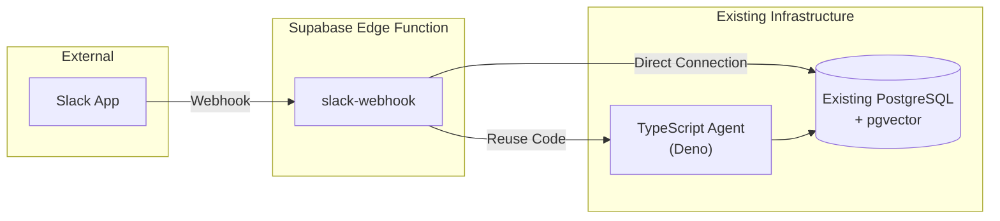

# Slack Edge Function Design (Minimal Integration)

## Overview

This document describes a minimal Supabase Edge Function implementation that serves as a bridge between Slack and the existing Personal Agent system. The goal is to enable Slack integration with minimal changes to the current architecture.

## Architecture



## Design Principles

1. **Minimal Supabase Dependency**: Only use Edge Function for Slack webhook handling
2. **Reuse Existing Code**: Import and use the existing TypeScript agent directly
3. **No Database Changes**: Connect to existing PostgreSQL (not Supabase's)
4. **No Authentication Changes**: Keep current database connection approach
5. **Keep Existing Tools**: Continue using goose for migrations, existing CLI tools

## Implementation

### Project Structure
```
supabase/
└── functions/
    └── slack-webhook/
        ├── index.ts        # Main handler
        └── deno.json       # Import map for existing code
```

### Edge Function Implementation

```typescript
// supabase/functions/slack-webhook/index.ts
import { serve } from "https://deno.land/std@0.168.0/http/server.ts";
import { createHmac } from "https://deno.land/node/crypto.ts";
import { Pool } from "https://deno.land/x/postgres@v0.17.0/mod.ts";

// Import existing agent code directly
import { createPersonalAgent } from "../../../typescript/src/agent/Agent.ts";
import { Config } from "../../../typescript/src/config/index.ts";

// Slack signature verification
function verifySlackSignature(
  body: string,
  timestamp: string,
  signature: string,
  secret: string
): boolean {
  const baseString = `v0:${timestamp}:${body}`;
  const hmac = createHmac("sha256", secret);
  hmac.update(baseString);
  const expectedSignature = `v0=${hmac.digest("hex")}`;
  return expectedSignature === signature;
}

// Format Slack message
function formatSlackResponse(agentResponse: string, sources?: any[]): any {
  const blocks = [
    {
      type: "section",
      text: {
        type: "mrkdwn",
        text: agentResponse,
      },
    },
  ];

  // Add sources if available
  if (sources && sources.length > 0) {
    blocks.push({
      type: "context",
      elements: sources.slice(0, 3).map(source => ({
        type: "mrkdwn",
        text: `📄 ${source.path || source.type}`,
      })),
    });
  }

  return { blocks };
}

serve(async (req) => {
  try {
    // Get Slack headers
    const signature = req.headers.get("X-Slack-Signature");
    const timestamp = req.headers.get("X-Slack-Request-Timestamp");
    const body = await req.text();

    // Verify Slack signature
    const slackSecret = Deno.env.get("SLACK_SIGNING_SECRET");
    if (!verifySlackSignature(body, timestamp!, signature!, slackSecret!)) {
      return new Response("Unauthorized", { status: 401 });
    }

    // Parse Slack event
    const payload = JSON.parse(body);

    // Handle URL verification
    if (payload.type === "url_verification") {
      return new Response(payload.challenge);
    }

    // Handle events
    if (payload.type === "event_callback") {
      const event = payload.event;

      // Only respond to mentions and direct messages
      if (event.type !== "app_mention" && event.type !== "message") {
        return new Response("OK");
      }

      // Skip bot messages
      if (event.bot_id) {
        return new Response("OK");
      }

      // Extract message text (remove bot mention)
      const text = event.text.replace(/<@[A-Z0-9]+>/g, "").trim();

      // Create database connection (to existing PostgreSQL)
      const pool = new Pool({
        user: Deno.env.get("DB_USER"),
        password: Deno.env.get("DB_PASSWORD"),
        database: Deno.env.get("DB_NAME"),
        hostname: Deno.env.get("DB_HOST"),
        port: parseInt(Deno.env.get("DB_PORT") || "5432"),
        tls: { enabled: false }, // Adjust based on your setup
      }, 3);

      // Create config (reuse existing config structure)
      const config: Config = {
        openai: {
          apiKey: Deno.env.get("OPENAI_API_KEY")!,
          model: Deno.env.get("OPENAI_MODEL") || "gpt-4o-mini",
          embeddingModel: Deno.env.get("OPENAI_EMBEDDING_MODEL") || "text-embedding-3-small",
        },
      };

      // Create agent instance
      const agent = await createPersonalAgent(config, pool);

      // Invoke agent
      const sessionId = `slack-${event.channel}-${event.user}`;
      const result = await agent.invoke(
        {
          messages: [{ role: "user", content: text }],
        },
        {
          configurable: { thread_id: sessionId },
        }
      );

      // Extract response
      const agentResponse = result.messages[result.messages.length - 1].content;

      // Post response to Slack
      const slackToken = Deno.env.get("SLACK_BOT_TOKEN");
      const slackResponse = await fetch("https://slack.com/api/chat.postMessage", {
        method: "POST",
        headers: {
          "Authorization": `Bearer ${slackToken}`,
          "Content-Type": "application/json",
        },
        body: JSON.stringify({
          channel: event.channel,
          thread_ts: event.thread_ts || event.ts,
          ...formatSlackResponse(agentResponse),
        }),
      });

      if (!slackResponse.ok) {
        console.error("Failed to post to Slack:", await slackResponse.text());
      }

      // Clean up
      await pool.end();

      return new Response("OK");
    }

    return new Response("OK");
  } catch (error) {
    console.error("Error:", error);
    return new Response("Internal Server Error", { status: 500 });
  }
});
```

### Import Map Configuration

```json
// supabase/functions/slack-webhook/deno.json
{
  "imports": {
    "@langchain/": "https://esm.sh/@langchain/",
    "pg": "https://deno.land/x/postgres@v0.17.0/mod.ts"
  }
}
```

## Deployment Steps

### 1. Initialize Supabase (Minimal Setup)
```bash
# Create a new Supabase project (only for Edge Functions)
supabase init

# Link to your Supabase project
supabase link --project-ref <your-project-ref>
```

### 2. Set Environment Variables
```bash
# Set secrets for the Edge Function
supabase secrets set SLACK_SIGNING_SECRET=<your-slack-signing-secret>
supabase secrets set SLACK_BOT_TOKEN=<your-slack-bot-token>
supabase secrets set OPENAI_API_KEY=<your-openai-api-key>

# Database connection (your existing PostgreSQL)
supabase secrets set DB_HOST=<your-db-host>
supabase secrets set DB_PORT=<your-db-port>
supabase secrets set DB_NAME=personal_agent
supabase secrets set DB_USER=<your-db-user>
supabase secrets set DB_PASSWORD=<your-db-password>
```

### 3. Deploy the Function
```bash
# Deploy only the Slack webhook function
supabase functions deploy slack-webhook
```

### 4. Configure Slack App
1. Go to your Slack App settings
2. Add the Edge Function URL as the Event Subscriptions URL:
   ```
   https://<project-ref>.supabase.co/functions/v1/slack-webhook
   ```
3. Subscribe to these events:
   - `app_mention`
   - `message.im` (for direct messages)
4. Add OAuth scopes:
   - `chat:write`
   - `app_mentions:read`
   - `im:history`

## Local Development

```bash
# Test locally with existing PostgreSQL
supabase functions serve slack-webhook --env-file .env.local

# Test with curl
curl -X POST http://localhost:54321/functions/v1/slack-webhook \
  -H "X-Slack-Signature: <signature>" \
  -H "X-Slack-Request-Timestamp: <timestamp>" \
  -d '{"type": "event_callback", "event": {"type": "app_mention", "text": "Hello"}}'
```

## Benefits of This Approach

1. **Minimal Changes**: No modifications to existing codebase
2. **No Lock-in**: Only using Edge Function as a webhook handler
3. **Existing Database**: Connects to your current PostgreSQL
4. **Reuse Code**: Imports and uses existing agent implementation
5. **Simple Deployment**: Single function, minimal configuration

## Limitations & Considerations

1. **Cold Starts**: First invocation may be slower (~2-3s)
2. **Timeout**: Edge Functions have a 150s timeout
3. **Memory**: Limited to 150MB RAM per invocation
4. **Dependencies**: Need to ensure all dependencies work in Deno

## Alternative: Self-Hosted Webhook

If you want even less Supabase dependency, you could:
1. Run the TypeScript agent as a long-running Deno service
2. Add a simple HTTP endpoint for Slack webhooks
3. Deploy on your own infrastructure (VPS, container, etc.)

This would eliminate Supabase entirely but requires managing your own deployment.

## Summary

This design provides Slack integration through a single Supabase Edge Function while keeping all other components unchanged. The Edge Function acts purely as a webhook handler that reuses your existing agent code and connects to your existing database.